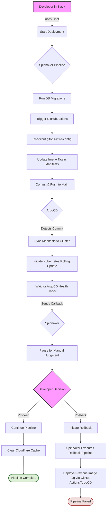

```mermaid
flowchart TD
    A[Developer in Slack] -->|uses Dbot| B(Start Deployment);
    
    B --> C{Spinnaker Pipeline};
    C --> D[Run DB Migrations];
    D --> E[Trigger GitHub Actions];
    
    E --> F[Checkout gitops-infra-config];
    F --> G[Update Image Tag in Manifests];
    G --> H[Commit & Push to Main];
    
    H --> I{ArgoCD};
    I -->|Detects Commit| J[Sync Manifests to Cluster];
    J --> K[Initiate Kubernetes Rolling Update];
    
    K --> L[Wait for ArgoCD Health Check];
    L -->|Sends Callback| M{Spinnaker};
    
    M --> N["Pause for Manual Judgment"];
    N --> O{Developer Decision};
    
    O -- "Proceed" --> P[Continue Pipeline];
    O -- "Rollback" --> Q[Initiate Rollback];
    
    P --> R[Clear Cloudflare Cache];
    R --> S([Pipeline Complete]);
    
    Q --> T[Spinnaker Executes Rollback Pipeline];
    T --> U[Deploys Previous Image Tag via GitHub Actions/ArgoCD];
    U --> V([Pipeline Failed]);

    %% Styling
    style A fill:#f9f,stroke:#333,stroke-width:2px
    style O fill:#f9f,stroke:#333,stroke-width:2px
    style S fill:#dff0d8,stroke:#3c763d,stroke-width:2px
    style V fill:#f2dede,stroke:#a94442,stroke-width:2px
```
