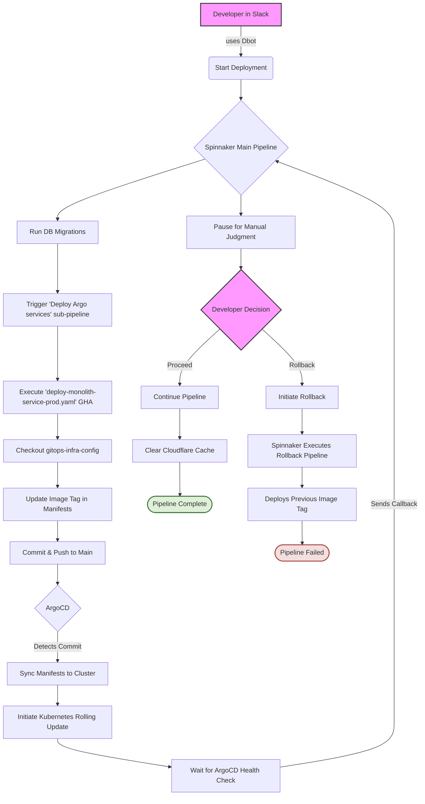

```mermaid
flowchart TD
    A[Developer in Slack] -->|uses Dbot| B(Start Deployment);
    
    B --> C{"Spinnaker Main Pipeline"};
    C --> D[Run DB Migrations];
    D --> E[Trigger 'Deploy Argo services' sub-pipeline];
    
    E --> F["Execute 'deploy-monolith-service-prod.yaml' GHA"];
    F --> G[Checkout gitops-infra-config];
    G --> H[Update Image Tag in Manifests];
    H --> I[Commit & Push to Main];
    
    I --> J{ArgoCD};
    J -->|Detects Commit| K[Sync Manifests to Cluster];
    K --> L[Initiate Kubernetes Rolling Update];
    
    L --> M[Wait for ArgoCD Health Check];
    M -->|Sends Callback| C;
    
    C --> N["Pause for Manual Judgment"];
    N --> O{Developer Decision};
    
    O -- "Proceed" --> P[Continue Pipeline];
    O -- "Rollback" --> Q[Initiate Rollback];
    
    P --> R[Clear Cloudflare Cache];
    R --> S([Pipeline Complete]);
    
    Q --> T[Spinnaker Executes Rollback Pipeline];
    T --> U[Deploys Previous Image Tag];
    U --> V([Pipeline Failed]);

    %% Styling
    style A fill:#f9f,stroke:#333,stroke-width:2px
    style O fill:#f9f,stroke:#333,stroke-width:2px
    style S fill:#dff0d8,stroke:#3c763d,stroke-width:2px
    style V fill:#f2dede,stroke:#a94442,stroke-width:2px
```
